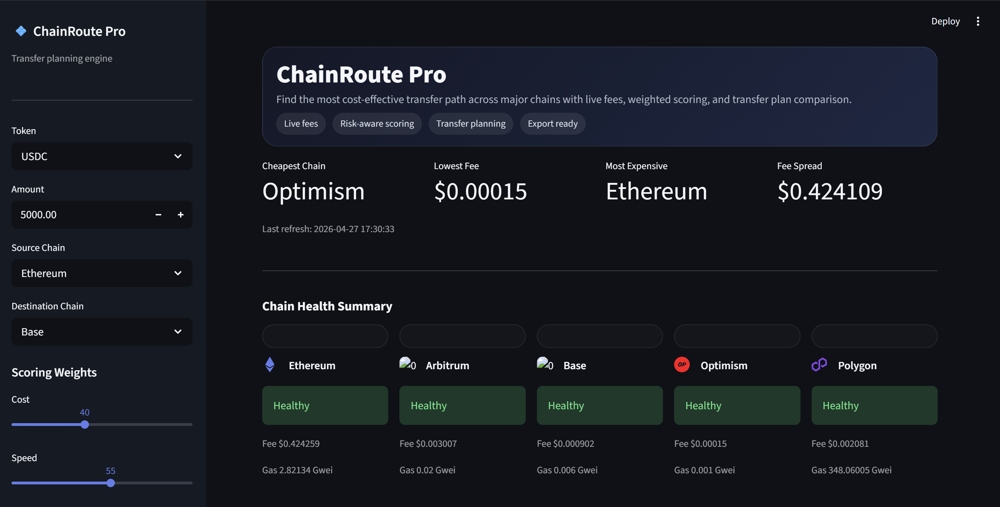

\# Crypto Fee Router



\## Preview







\## Demo



!\[Demo](assets/demo.gif)



A lightweight multi-chain fee routing dashboard that compares transaction costs across EVM networks and recommends the best route based on cost, speed, reliability, and risk.



\## What it does



\- Fetches live fee data from multiple EVM chains

\- Compares Ethereum, Base, Arbitrum, Optimism, and Polygon

\- Estimates transaction costs

\- Calculates a routing score for each chain

\- Displays the results in a real-time Streamlit dashboard

\- Uses a FastAPI backend for fee aggregation and routing logic



\## Tech Stack



\- Python

\- FastAPI

\- Web3.py

\- Streamlit

\- Pandas

\- Uvicorn



\## Project Structure



```text

crypto-fee-router/

|-- app/

|   |-- api/

|   |-- core/

|   |-- models/

|   |-- services/

|-- assets/

|   |-- dashboard-preview.png

|   |-- demo.webm

|-- dashboard.py

|-- requirements.txt

|-- .env.example

|-- README.md

